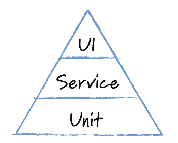
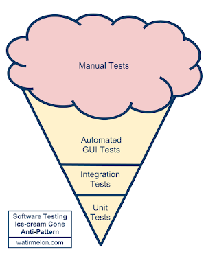
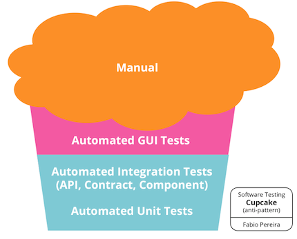

## Estruturas de Testes

#### Conceito

Estruturas de Testes, Formatos de Testes, ou _Shapes of Testing_ são formas gráficas de demonstrar tipos, tamanho, velocidade de implementação e complexidade dos testes realizados em um sistema. Através desss formato é possível determinar o custo de implementar e manter cada nível de teste, além de fornecer informaçãoes de qual nível deve ser testado primeiro e por quê.

**Pirâmide**

A pirâmide de testes original de Mike Cohn consiste em três camadas que seu conjunto de testes deve ter:
1. Testes de Interface de Usuário, ou em alguns casos, Testes E2E
2. Testes de Integração
3. Testes Unitários

Devido à sua simplicidade, a essência da pirâmide serve como uma boa regra geral quando se trata de estabelecer seu próprio conjunto de testes. O princípios básicos dessa estrutura são:
* Escreva testes com granularidade diferente
* Quanto mais alto o nível, menos testes você deve ter

**Cone de Sorvete e Cupcake**

Possui 4 camadas:
1. Testes Manuais
2. Testes de Interface de Usuário Automatizados
3. Testes de Integração
4. Testes Unitários

Princípios básicos dessa estrutura:
* Quanto mais baixo o nível, menos testes você deve ter
* Deixe grande parte do trabalho para o QA

(Muito ruim, quanto mais o software cresce mais impossível se torna testá-lo)

O cupcake é similar ao Cone de Sorvete com a diferença de ter Testes de Integração e Unitários no mesmo nível. Em algumas imagens da internet ele é idêntico ao Cone.

**Troféu**

Criada a partir da frase de Guillermo Rauch (criados do Soket.io) "Escreva testes. Não muitos. Na maior parte, de integração". Esse formato possui 4 camadas:
1. Testes E2E
2. Testes de Integração
3. Testes Unitários
4. Testes Estáticos

A motivação dessa estrutura é focar no ponto em que o melhor retorno de tempo gasto escrevendo testes é obtido. Esse ponto reside nos testes de integração, pois você precisa de menos deles para detectar problemas reais, além de serem rápidos o suficiente para escrevê uma quantidade razoável deles. Esse modelo também valoriza testes estáticos, pois são baratos no que tange tempo e custo, dentro desse tipo de teste encontramos _linters_, verificadores de tipo, que não podem simplesmente ser ignorados num projeto. Apesar desse tipo de teste não detectar bugs, ele ajuda a manter boas práticas sem muito esforço humano.

**Obs.:** O objetivo dessa aula é dar uma visão geral do que são formatos de teste e quais são os mais conhecidos/utilizados. Existe muita discussão na internet sobre qual é o melhor deles, mas cada um deles tem vantagens e desvantagens, e funciona melhor/pior em determinados contextos. Se desejar, forneça algum material para leitura sem obrigatoriedade.

### Links Úteis

* [On the Diverse And Fantastical Shapes of Testing](https://martinfowler.com/articles/2021-test-shapes.html)
* [The Practical Test Pyramid](https://martinfowler.com/articles/practical-test-pyramid.html)
* [Pirâmide de Testes — Definindo uma boa suíte de testes para seu Software](https://medium.com/luizalabs/pir%C3%A2mide-de-testes-definindo-uma-boa-su%C3%ADte-de-testes-para-seu-software-a6864886f29b)
* [O QUE É A PIRÂMIDE DE TESTES?](https://blog.onedaytesting.com.br/piramide-de-teses/)
* [Testing is Good. Pyramids are Bad. Ice Cream Cones are the Worst](https://medium.com/@fistsOfReason/testing-is-good-pyramids-are-bad-ice-cream-cones-are-the-worst-ad94b9b2f05f)
* [Write tests. Not too many. Mostly integration.](https://kentcdodds.com/blog/write-tests)
* [The Testing Trophy and Testing Classifications](https://kentcdodds.com/blog/the-testing-trophy-and-testing-classifications)
* [Three Reasons To Win The Testing Trophy](https://andersenlab.com/blueprint/win-the-testing-trophy)
* [The Software Testing Ice Cream Cone](https://saeedgatson.com/the-software-testing-ice-cream-cone/)
* [Introducing the Software Testing Cupcake (Anti-Pattern)](https://www.thoughtworks.com/insights/blog/introducing-software-testing-cupcake-anti-pattern)